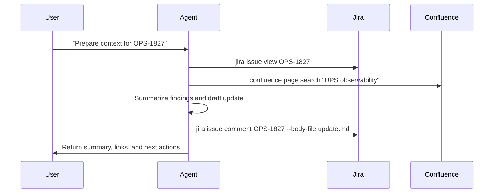

# AI Agent Extension

How prompts become repeatable work through agent loops, GitHub Copilot, tools, memory, and CLIs

<div class="mt-10 topic-list">
  <div>Agent Loop Flow</div>
  <div>GitHub Copilot Agent Extension</div>
  <div>What Else?</div>
</div>

---

# Topic Map

<div class="numbered-flow mt-8">
  <div><b>1. Agent Loop Flow</b><span>How an agent moves from prompt to action, observation, verification, and result.</span></div>
  <div><b>2. GitHub Copilot Agent Extension</b><span>Tools and memory as the two practical extension surfaces inside the editor.</span></div>
  <div><b>3. What Else?</b><span>Scheduled work, code review, and runbook hygiene as the next operating layer.</span></div>
</div>

---
layout: two-cols
---

# Agent Loop Flow

The agent is useful when it can close a loop: read context, choose an action, call a tool, observe the result, and decide the next step.

<div class="mt-8 space-y-4 text-xl">

- Prompt gives the target and constraints.
- Instructions provide operating rules.
- Skills package reusable workflows.
- Tools and memory connect actions to durable context and real systems.
- Verification decides whether to continue or stop.

</div>

::right::

<AgentLoop />


---
class: interactive-slide
---

<AgentLayerVisualizer />

---

# GitHub Copilot Agent Extension

GitHub Copilot becomes more valuable when the editor agent can use local context and trusted tools instead of only generating text.

<div class="config-grid mt-8">
  <div><b>Workspace Context</b><span>Open files, repository structure, terminal output, selected code, and current diff.</span></div>
  <div><b>Instructions</b><span>Project-specific rules that shape how the agent plans, edits, verifies, and reports.</span></div>
  <div><b>Tools</b><span>Bash, tests, file edits, browser checks, GitHub operations, and approved custom CLIs.</span></div>
  <div><b>Memory</b><span>Stable workspace notes, service facts, reusable decisions, and correction history.</span></div>
</div>

---

# Tools: Theory

Tools turn Copilot from a text generator into an operator that can inspect, execute, and verify work inside the editor.

<div class="split-list mt-8">
  <div>
    <h2>Capabilities</h2>
    <ul>
      <li>Inspect files, diffs, terminal output, and package scripts</li>
      <li>Run builds, tests, linters, and safe diagnostic commands</li>
      <li>Call approved CLIs for Jira, Confluence, AWS, and internal systems</li>
      <li>Return command evidence instead of guesses</li>
    </ul>
  </div>
  <div>
    <h2>Boundaries</h2>
    <ul>
      <li>Readonly first for production systems</li>
      <li>Explicit approval before writes or status changes</li>
      <li>No secret exposure in prompts, logs, or summaries</li>
      <li>Verification before reporting completion</li>
    </ul>
  </div>
</div>

---

# Tools Example: Setup Jira & Confluence

Goal: make the agent able to read tickets, search docs, draft updates, and connect engineering work to team knowledge.

<div class="numbered-flow mt-8">
  <div><b>1. Package the skill</b><span>Create a reusable setup playbook for Atlassian CLI usage.</span></div>
  <div><b>2. Download tools</b><span>Install `jira` and `confluence` into a stable workspace tool directory.</span></div>
  <div><b>3. Configure PATH</b><span>Expose the tool directory to VS Code, terminal, and the agent runtime.</span></div>
  <div><b>4. Authorize accounts</b><span>Run browser or token-based login and validate identity.</span></div>
  <div><b>5. Add instructions</b><span>Define safe commands, approval boundaries, and evidence format.</span></div>
</div>

---

# Tools Example: Instruction Contract

```md
# Atlassian CLI Skill

Setup:
- Install `jira` and `confluence` into `tools/bin`.
- Add `tools/bin` to PATH for the workspace terminal.
- Run `jira auth login` and `confluence auth login`.
- Validate with `jira me` and `confluence spaces list`.

Rules:
- Read before writing.
- Link ticket IDs in every update.
- Ask for approval before changing ticket status.
```

---

# Tools Example: Runtime Flow



<div class="mt-6 text-xl opacity-80">
The agent is no longer guessing from stale chat. It is reading the system of record and writing back with traceable context.
</div>

---

# Memory: Theory

Memory gives Copilot durable context that survives the current chat, but it should be managed like project documentation.

<div class="split-list mt-8">
  <div>
    <h2>Keep</h2>
    <ul>
      <li>Stable service facts, owners, and environment names</li>
      <li>Recurring corrections and team preferences</li>
      <li>Runbook pointers and known safe commands</li>
      <li>Decision records that affect future agent work</li>
    </ul>
  </div>
  <div>
    <h2>Govern</h2>
    <ul>
      <li>Store memory in reviewed Markdown files</li>
      <li>Prefer facts over guesses or private chat fragments</li>
      <li>Expire stale entries with dates or owners</li>
      <li>Never store secrets, tokens, or personal data</li>
    </ul>
  </div>
</div>

---

# Memory Example: Setup

Goal: give the agent stable context without depending on chat history or hidden assumptions.

<div class="numbered-flow mt-8">
  <div><b>1. Create memory files</b><span>Add `.github/copilot-instructions.md`, `.agent/memory.md`, and `.agent/runbook-index.md`.</span></div>
  <div><b>2. Define the contract</b><span>Tell Copilot when to read memory, when it may update memory, and how to cite evidence.</span></div>
  <div><b>3. Seed stable facts</b><span>Record service owners, approved CLIs, readonly defaults, and runbook links.</span></div>
  <div><b>4. Review changes</b><span>Memory updates go through normal diff review before becoming durable context.</span></div>
  <div><b>5. Use it in tasks</b><span>The agent reads memory before Jira, Confluence, AWS, or production-support workflows.</span></div>
</div>

---

# Example: Get AWS RDS Profile

Goal: help a user obtain and verify a readonly AWS profile for RDS investigation without exposing secrets or skipping policy.

<div class="numbered-flow mt-8">
  <div><b>1. Read the runbook</b><span>Find the approved access request, login, and readonly boundaries.</span></div>
  <div><b>2. Resolve ownership</b><span>Query service metadata for account, environment, and RDS identifiers.</span></div>
  <div><b>3. Authenticate</b><span>Run SSO login for the readonly AWS profile.</span></div>
  <div><b>4. Verify access</b><span>Use harmless identity and describe commands before any investigation.</span></div>
  <div><b>5. Return exact commands</b><span>Give the user a profile command sequence with caveats and evidence.</span></div>
</div>

---

# AWS RDS Profile Command Path

```bash
runbook search "RDS readonly profile"
runbook view production-rds-readonly-access
service-catalog get ups-obs --env prod --format json

aws sso login --profile ups-obs-prod-readonly
aws sts get-caller-identity --profile ups-obs-prod-readonly
aws rds describe-db-instances \
  --profile ups-obs-prod-readonly \
  --query "DBInstances[].{id:DBInstanceIdentifier,status:DBInstanceStatus}"
```

<div class="mt-6 text-xl opacity-80">
The behavior to teach is the sequence: read policy, resolve context, authenticate safely, verify, then report exact commands.
</div>

---

# What Else?

Once tools and memory are reliable, the agent can become part of the team operating rhythm.

<div class="work-board mt-8">
  <div><b>Scheduled Work</b><span>Let the agent triage tickets, validate runbooks, check release readiness, and prepare follow-ups.</span></div>
  <div><b>Team Backlog</b><span>Assign narrow Jira tickets with clear acceptance criteria, repo access, and verification commands.</span></div>
  <div><b>GitHub Review</b><span>Ask for review that focuses on behavior, risk, tests, migrations, rollout, and observability.</span></div>
  <div><b>Runbook Hygiene</b><span>Have the agent periodically test docs against real commands and open updates when steps drift.</span></div>
</div>

---

# Closing Thought

<div class="text-3xl leading-relaxed mt-8">
AI Agent Extension is not about making chat longer. It is about giving the agent trusted tools, useful memory, clear boundaries, and verified feedback loops.
</div>

<div class="risk-list mt-10">
  <div><b>Give it context</b><span>Project files, tickets, docs, runbooks, and current diffs.</span></div>
  <div><b>Give it tools</b><span>Bash, CLIs, browser checks, GitHub, cloud access, and internal service commands.</span></div>
  <div><b>Give it boundaries</b><span>Readonly defaults, approval rules, secret handling, and definition of done.</span></div>
  <div><b>Give it real work</b><span>Tickets, reviews, setup tasks, investigations, and repeatable operations.</span></div>
</div>
