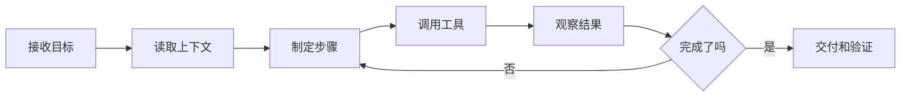

# AI Agent 分享

从一次对话，到一个可以使用工具、执行任务、验证结果的系统

<div class="mt-10 text-sm opacity-70">Slidev sample deck · dvnuo/slidev-show</div>

---
layout: two-cols
---

# Agent 是什么

Agent 不是一个更长的 prompt，而是一组运行时能力。

<div v-clicks class="mt-8 space-y-4 text-xl">

- 理解目标和约束
- 规划可执行步骤
- 调用工具读写外部世界
- 观察结果并修正路线
- 交付可验证的产物

</div>

::right::

<AgentLoop />

---

# 和普通聊天的差异

| 能力 | Chat | Agent |
| --- | --- | --- |
| 上下文 | 主要依赖对话 | 对话、文件、接口、运行结果 |
| 行动 | 给建议 | 调工具、改文件、跑命令 |
| 反馈 | 用户手动反馈 | 自动观察 stdout、测试、页面 |
| 交付 | 文本答案 | 代码、部署、报告、自动化 |

---
layout: center
---

# 一个实用心智模型

<div class="agent-grid mt-8">
  <div><b>目标</b><span>用户真正想完成什么</span></div>
  <div><b>状态</b><span>当前代码、数据、环境是什么</span></div>
  <div><b>工具</b><span>能读取、修改、验证哪些东西</span></div>
  <div><b>策略</b><span>如何拆解、选择和回滚</span></div>
</div>

---

# Agent 工作流



---

# 工具让 Agent 变得具体

<div class="tool-grid mt-8">
  <div>
    <b>文件系统</b>
    <span>读项目结构、编辑代码、生成文档</span>
  </div>
  <div>
    <b>Shell</b>
    <span>安装依赖、运行测试、构建产物</span>
  </div>
  <div>
    <b>浏览器</b>
    <span>打开页面、点击操作、截图检查</span>
  </div>
  <div>
    <b>外部服务</b>
    <span>访问 GitHub、数据库、云平台和业务 API</span>
  </div>
</div>

---

# 设计 Agent 时的关键问题

<div v-clicks class="mt-8 space-y-5 text-2xl">

- 目标是否可验证？
- 工具权限是否足够且边界清晰？
- 每一步失败时如何恢复？
- 产物如何被测试、审查和部署？
- 用户应该在哪些节点介入？

</div>

---

# 最小可用 Agent 架构

```ts
type AgentRuntime = {
  goal: string
  context: ContextProvider[]
  tools: Tool[]
  planner: Planner
  verifier: Verifier
  memory?: MemoryStore
}
```

<div class="mt-6 text-xl opacity-80">
先把目标、上下文、工具和验证闭环做好，再讨论复杂的长期记忆和多 Agent 协作。
</div>

---

# 风险控制

<div class="risk-list mt-8">
  <div><b>权限最小化</b><span>默认只给完成任务所需的工具和路径。</span></div>
  <div><b>可观察性</b><span>记录关键动作、命令输出、外部 API 响应。</span></div>
  <div><b>人工确认</b><span>对高风险写操作、付款、发布和删除设门槛。</span></div>
  <div><b>自动验证</b><span>用测试、lint、截图和健康检查减少主观判断。</span></div>
</div>

---
layout: center
---

# 结论

<div class="text-3xl leading-relaxed mt-8">
AI Agent 的价值不只是“会说”，而是能在受控环境里持续行动，并把结果带回来验证。
</div>

<div class="mt-10 opacity-70">目标清楚、工具可靠、反馈及时，Agent 才能真正进入生产流程。</div>
