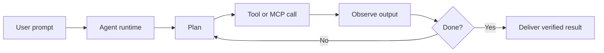
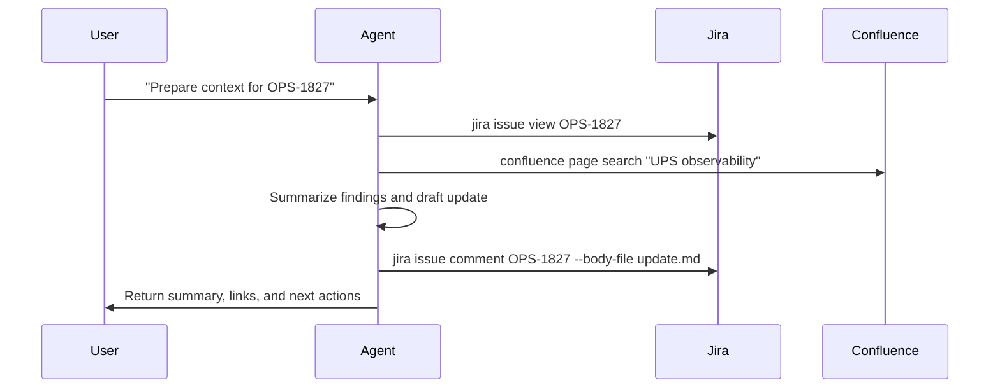

# AI Agent Extension

How prompts become repeatable work through agent loops, GitHub Copilot, instructions, tools, MCP, and CLIs

<div class="mt-10 topic-list">
  <div>Agent Loop Flow</div>
  <div>GitHub Copilot Agent Extension</div>
  <div>Example: Setup Jira & Confluence Tool</div>
  <div>Example: Get AWS RDS Profile</div>
  <div>What Else?</div>
</div>

---

# Topic Map

<div class="numbered-flow mt-8">
  <div><b>1. Agent Loop Flow</b><span>What the agent loop is and why tool feedback changes the work model.</span></div>
  <div><b>2. GitHub Copilot Agent Extension</b><span>Where instructions, tools, MCP, and custom CLIs fit in the editor.</span></div>
  <div><b>3. Setup Jira & Confluence Tool</b><span>A concrete extension path for ticket and documentation workflows.</span></div>
  <div><b>4. Get AWS RDS Profile</b><span>A production-safe example that combines runbooks, AWS CLI, and verification.</span></div>
  <div><b>5. What Else?</b><span>Memory, scheduled work, and code review as the next operating layer.</span></div>
</div>

---
layout: two-cols
---

# Agent Loop Flow

The agent is useful when it can close a loop: read context, choose an action, call a tool, observe the result, and decide the next step.

<div class="mt-8 space-y-4 text-xl">

- Prompt gives the target and constraints.
- Instructions provide operating rules.
- Skills package reusable workflows.
- Tools and MCP connect to real systems.
- Verification decides whether to continue or stop.

</div>

::right::

<AgentLoop />

---

# Agent Loop Flow



<div class="mt-6 text-xl opacity-80">
The extension point is not only the model. It is the loop around the model: instructions, skills, tools, MCP, and evidence.
</div>

---
class: interactive-slide
---

<AgentLayerVisualizer />

---

# GitHub Copilot Agent Extension

GitHub Copilot becomes more valuable when the editor agent can use local context and trusted tools instead of only generating text.

<div class="config-grid mt-8">
  <div><b>Workspace Context</b><span>Open files, repository structure, terminal output, selected code, and current diff.</span></div>
  <div><b>Instructions</b><span>Project-specific rules that shape how the agent plans, edits, verifies, and reports.</span></div>
  <div><b>Tools</b><span>Bash, test runners, file edits, browser checks, GitHub operations, and custom CLIs.</span></div>
  <div><b>MCP</b><span>A consistent boundary for exposing external systems such as Jira, Confluence, cloud, and internal data.</span></div>
</div>

---

# Extension Points: Tools And Instructions

<div class="split-list mt-8">
  <div>
    <h2>Tools</h2>
    <p>Tools define what the agent can do.</p>
    <ul>
      <li>Run safe terminal commands</li>
      <li>Read runbooks and tickets</li>
      <li>Query logs or cloud metadata</li>
      <li>Build, test, and verify changes</li>
      <li>Post evidence back to GitHub or Jira</li>
    </ul>
  </div>
  <div>
    <h2>Instructions</h2>
    <p>Instructions define how the agent should act.</p>
    <ul>
      <li>Prefer approved CLIs</li>
      <li>Start readonly by default</li>
      <li>Read runbooks before production work</li>
      <li>Never reveal secrets</li>
      <li>Return command evidence</li>
    </ul>
  </div>
</div>

---

# Bash Tool: From Chat To Operator

The Bash tool is the bridge from advice to execution. It lets the agent inspect, act, and verify inside the same workflow.

<div class="tool-grid mt-8">
  <div><b>Discover</b><span>List files, inspect package scripts, read config, and identify local conventions.</span></div>
  <div><b>Execute</b><span>Run setup commands, tests, builds, CLIs, and safe diagnostic commands.</span></div>
  <div><b>Integrate</b><span>Call Jira, Confluence, AWS, database clients, and internal tools through a known interface.</span></div>
  <div><b>Verify</b><span>Compare output with acceptance criteria and retry with concrete evidence.</span></div>
</div>

---

# Example: Setup Jira & Confluence Tool

Goal: make the agent able to read tickets, search docs, draft updates, and connect engineering work to team knowledge.

<div class="numbered-flow mt-8">
  <div><b>1. Package the skill</b><span>Create a reusable setup playbook for Atlassian CLI usage.</span></div>
  <div><b>2. Download tools</b><span>Install `jira` and `confluence` into a stable workspace tool directory.</span></div>
  <div><b>3. Configure PATH</b><span>Expose the tool directory to VS Code, terminal, and the agent runtime.</span></div>
  <div><b>4. Authorize accounts</b><span>Run browser or token-based login and validate identity.</span></div>
  <div><b>5. Add instructions</b><span>Define safe commands, approval boundaries, and evidence format.</span></div>
</div>

---

# Skill And Instruction Shape

```md
# Atlassian CLI Skill

Setup:
- Install `jira` and `confluence` into `tools/bin`.
- Add `tools/bin` to PATH for the workspace terminal.
- Run `jira auth login` and `confluence auth login`.
- Validate with `jira me` and `confluence spaces list`.

Rules:
- Read before writing.
- Link ticket IDs in every update.
- Ask for approval before changing ticket status.
```

---

# Jira And Confluence Flow



<div class="mt-6 text-xl opacity-80">
The agent is no longer guessing from memory. It is reading the system of record and writing back with traceable context.
</div>

---

# Example: Get AWS RDS Profile

Goal: help a user obtain and verify a readonly AWS profile for RDS investigation without exposing secrets or skipping policy.

<div class="numbered-flow mt-8">
  <div><b>1. Read the runbook</b><span>Find the approved access request, login, and readonly boundaries.</span></div>
  <div><b>2. Resolve ownership</b><span>Query service metadata for account, environment, and RDS identifiers.</span></div>
  <div><b>3. Authenticate</b><span>Run SSO login for the readonly AWS profile.</span></div>
  <div><b>4. Verify access</b><span>Use harmless identity and describe commands before any investigation.</span></div>
  <div><b>5. Return exact commands</b><span>Give the user a profile command sequence with caveats and evidence.</span></div>
</div>

---

# AWS RDS Profile Command Path

```bash
runbook search "RDS readonly profile"
runbook view production-rds-readonly-access
service-catalog get ups-obs --env prod --format json

aws sso login --profile ups-obs-prod-readonly
aws sts get-caller-identity --profile ups-obs-prod-readonly
aws rds describe-db-instances \
  --profile ups-obs-prod-readonly \
  --query "DBInstances[].{id:DBInstanceIdentifier,status:DBInstanceStatus}"
```

<div class="mt-6 text-xl opacity-80">
The behavior to teach is the sequence: read policy, resolve context, authenticate safely, verify, then report exact commands.
</div>

---

# What Else?

Once tools and instructions are reliable, the agent can become part of the team operating rhythm.

<div class="work-board mt-8">
  <div><b>Long Memory</b><span>Use a managed Markdown memory file for stable service facts, owner rules, and recurring corrections.</span></div>
  <div><b>Scheduled Work</b><span>Let the agent triage tickets, validate runbooks, check release readiness, and prepare follow-ups.</span></div>
  <div><b>GitHub Review</b><span>Ask for review that focuses on behavior, risk, tests, migrations, rollout, and observability.</span></div>
  <div><b>Runbook Hygiene</b><span>Have the agent periodically test docs against real commands and open updates when steps drift.</span></div>
</div>

---

# Closing Thought

<div class="text-3xl leading-relaxed mt-8">
AI Agent Extension is not about making chat longer. It is about giving the agent trusted tools, clear instructions, and verified feedback loops.
</div>

<div class="risk-list mt-10">
  <div><b>Give it context</b><span>Project files, tickets, docs, runbooks, and current diffs.</span></div>
  <div><b>Give it tools</b><span>Bash, CLIs, MCP servers, browser checks, GitHub, and cloud access.</span></div>
  <div><b>Give it boundaries</b><span>Readonly defaults, approval rules, secret handling, and definition of done.</span></div>
  <div><b>Give it real work</b><span>Tickets, reviews, setup tasks, investigations, and repeatable operations.</span></div>
</div>
