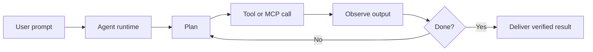
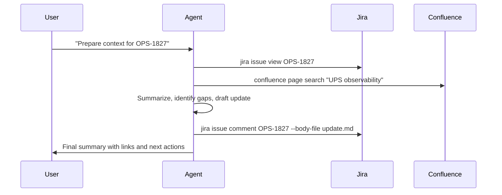
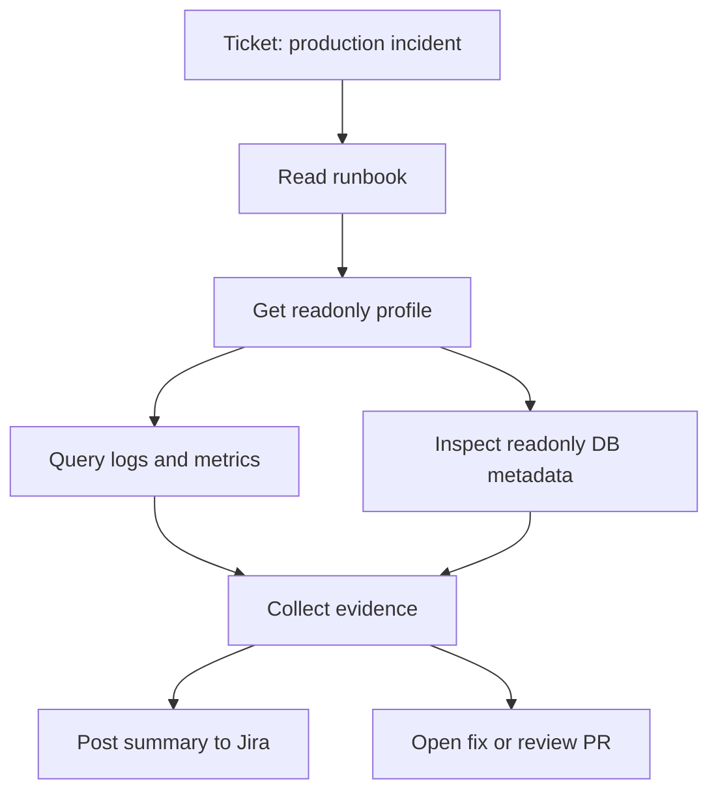

# AI Agent Operating Playbook

How prompts become repeatable work through instructions, skills, tools, MCP, and CLIs

<div class="mt-10 text-sm opacity-70">Slidev sample deck · dvnuo/slidev-show</div>

---
layout: two-cols
---

# The Basic Agent Runtime

An agent is not just a larger prompt. It is a loop that can read context, choose tools, act, observe results, and update its next step.

<div v-clicks class="mt-8 space-y-4 text-xl">

- A user gives the target and constraints.
- The system prompt sets global behavior and safety rules.
- Instructions and skills provide local operating knowledge.
- Tools and MCP servers connect the agent to real systems.
- Verification decides whether the work is complete.

</div>

::right::

<AgentLoop />

---

# What Is Inside The Loop

<div class="runtime-map mt-8">
  <div><b>System Prompt</b><span>Global behavior, safety, tool policy, and response format.</span></div>
  <div><b>User Prompt</b><span>The immediate request, acceptance criteria, and business context.</span></div>
  <div><b>Instructions</b><span>Repository, workspace, team, and workflow preferences.</span></div>
  <div><b>Skills</b><span>Reusable playbooks for tasks such as setup, diagnosis, release, and review.</span></div>
  <div><b>Tools</b><span>Bash, file edits, browser, GitHub, cloud CLIs, test runners, and databases.</span></div>
  <div><b>MCP</b><span>A protocol boundary for exposing external tools and data sources consistently.</span></div>
</div>

---

# Prompt To Work



<div class="mt-6 text-xl opacity-80">
The important shift is that the agent can close the feedback loop without waiting for the user to manually run every command.
</div>

---

# GitHub Copilot Plugin Mental Model

GitHub Copilot in the editor is valuable because it sits next to the code, terminal, source control, and project context.

<div class="config-grid mt-8">
  <div>
    <b>Context</b>
    <span>Open files, workspace search, repository history, and selected code.</span>
  </div>
  <div>
    <b>Instructions</b>
    <span>Project-specific guidance that keeps the agent aligned with local standards.</span>
  </div>
  <div>
    <b>Tools</b>
    <span>Terminal, file edits, test runs, GitHub operations, and MCP-backed integrations.</span>
  </div>
  <div>
    <b>Review Surface</b>
    <span>Pull requests, comments, diffs, and issue context become natural checkpoints.</span>
  </div>
</div>

---

# The Two High-Leverage Knobs

<div class="split-list mt-8">
  <div>
    <h2>Tools</h2>
    <p>Tools define what the agent can actually do.</p>
    <ul>
      <li>Run a CLI</li>
      <li>Read a runbook</li>
      <li>Query a ticket system</li>
      <li>Inspect cloud logs</li>
      <li>Open a pull request</li>
    </ul>
  </div>
  <div>
    <h2>Instructions</h2>
    <p>Instructions define how the agent should use those abilities.</p>
    <ul>
      <li>Preferred commands</li>
      <li>Environment rules</li>
      <li>Approval boundaries</li>
      <li>Output formats</li>
      <li>Definition of done</li>
    </ul>
  </div>
</div>

---

# Why The Bash Tool Matters

The terminal turns the agent from an advisor into an operator.

<div class="tool-grid mt-8">
  <div><b>Project Discovery</b><span>List files, inspect dependencies, read configuration, and detect scripts.</span></div>
  <div><b>Build And Test</b><span>Install packages, run unit tests, start dev servers, and build artifacts.</span></div>
  <div><b>System Integration</b><span>Use internal CLIs, cloud CLIs, database clients, and log search commands.</span></div>
  <div><b>Verification</b><span>Compare command output against acceptance criteria and retry with evidence.</span></div>
</div>

---

# Instructions As A CLI Contract

Use instructions to teach the agent which custom CLIs exist, how to authenticate, and what must never be done.

```md
# CLI contract

- Prefer `jira`, `confluence`, `aws`, and `psql` over ad hoc API calls.
- Read the matching runbook before touching production.
- Use readonly profiles unless the user explicitly approves a write action.
- Never print tokens, cookies, passwords, or full connection strings.
- Include command summaries and verification evidence in the final response.
```

---

# Demo 1: Jira And Confluence CLI Setup

Goal: make the agent able to read project work, create updates, and link engineering context to documentation.

<div class="numbered-flow mt-8">
  <div><b>1. Package the skill</b><span>Create a reusable setup playbook for Atlassian CLI usage.</span></div>
  <div><b>2. Download tools</b><span>Install `jira` and `confluence` into a known tool directory.</span></div>
  <div><b>3. Configure PATH</b><span>Expose the tools to the editor terminal and agent runtime.</span></div>
  <div><b>4. Authorize accounts</b><span>Run browser or token-based login for Jira and Confluence.</span></div>
  <div><b>5. Write instructions</b><span>Tell the agent the safe commands and expected output style.</span></div>
</div>

---

# Skill: Atlassian CLI

```md
# Atlassian CLI Skill

Use this skill when a task requires Jira tickets or Confluence pages.

Setup:
- Install `jira` and `confluence` into `tools/bin`.
- Add `tools/bin` to PATH for the workspace terminal.
- Run `jira auth login` and `confluence auth login`.
- Validate with `jira me` and `confluence spaces list`.

Rules:
- Read before writing.
- Link ticket IDs in every update.
- Ask for approval before changing ticket status.
```

---

# Workspace Instruction Example

```md
# Agent instructions

Jira:
- Use `jira issue view <KEY>` before editing a ticket.
- Use `jira issue comment <KEY> --body-file <file>` for long updates.
- Do not transition status unless the user asks.

Confluence:
- Use `confluence page search "<query>"` before creating new pages.
- Prefer updating an existing runbook over duplicating content.
- Include source links when summarizing pages.
```

---

# Demo 1 Flow



---

# Demo 2: Combining More CLIs

The bigger win appears when the agent can chain CLIs across systems while following the runbook.

<div class="config-grid mt-8">
  <div><b>Runbook CLI</b><span>Find the required workflow before using production tools.</span></div>
  <div><b>AWS CLI</b><span>Authenticate with the right readonly profile and inspect logs.</span></div>
  <div><b>Database CLI</b><span>Use readonly credentials to inspect metadata or safe query results.</span></div>
  <div><b>Ticket CLI</b><span>Attach evidence and next steps back to the Jira ticket.</span></div>
</div>

---

# Example: UPS OBS Production Readonly Profile

The user asks how to get the `ups-obs-prod-readonly` profile.

<div class="numbered-flow mt-8">
  <div><b>1. Read the runbook</b><span>Find the approved profile request and login process.</span></div>
  <div><b>2. Resolve ownership</b><span>Query service metadata for UPS OBS production account and database names.</span></div>
  <div><b>3. Authenticate</b><span>Run `aws sso login --profile ups-obs-prod-readonly`.</span></div>
  <div><b>4. Verify access</b><span>Run a harmless identity or describe command.</span></div>
  <div><b>5. Return exact commands</b><span>Give the user a profile command sequence with caveats.</span></div>
</div>

---

# Agent Reads The Runbook First

```bash
runbook search "UPS OBS prod readonly profile"
runbook view ups-observability-production-access
service-catalog get ups-obs --env prod --format json
aws sso login --profile ups-obs-prod-readonly
aws sts get-caller-identity --profile ups-obs-prod-readonly
aws logs describe-log-groups --profile ups-obs-prod-readonly \
  --log-group-name-prefix /aws/ups-obs/prod
```

<div class="mt-6 text-xl opacity-80">
The useful behavior is not the command list alone. It is the discipline: read policy, resolve context, authenticate safely, then verify.
</div>

---

# Log And Database Investigation Pattern



---

# Simple Long Memory

You do not need a database to start. A disciplined Markdown file can carry stable team memory.

<div class="memory-grid mt-8">
  <div><b>Stable facts</b><span>Service names, owners, environments, safe profiles, and docs locations.</span></div>
  <div><b>Preferences</b><span>Team style, preferred CLIs, output format, and escalation rules.</span></div>
  <div><b>Decisions</b><span>Accepted tradeoffs, migration choices, and known constraints.</span></div>
  <div><b>Corrections</b><span>Things the agent got wrong and should not repeat.</span></div>
</div>

---

# Memory Management Instruction

```md
# Memory management

Read `AGENT_MEMORY.md` before planning non-trivial work.

Update memory only when the fact is stable, useful later, and supported by a source.
Each entry must include:
- Date
- Source link or command
- Scope
- Expiration or review trigger

Do not store secrets, personal data, tokens, or temporary incident details.
```

---

# What Else: Scheduled Work

Once tools and instructions are reliable, the agent can become part of the operating rhythm.

<div class="work-board mt-8">
  <div><b>Daily Triage</b><span>Read new Jira tickets, classify them, and draft missing context questions.</span></div>
  <div><b>Runbook Hygiene</b><span>Find stale steps, validate commands, and open documentation updates.</span></div>
  <div><b>Release Prep</b><span>Check changelog, tests, migration notes, and rollback instructions.</span></div>
  <div><b>Incident Follow-up</b><span>Collect evidence, draft timeline, and link PRs, logs, and tickets.</span></div>
</div>

---

# What Else: GitHub Review

Ask the agent to review like a teammate, not like a formatter.

<div class="review-list mt-8">
  <div><b>Behavior</b><span>Does the change satisfy the requirement without hidden regressions?</span></div>
  <div><b>Risk</b><span>What can fail in production, and how would we detect it?</span></div>
  <div><b>Tests</b><span>Are the important paths covered with the right level of confidence?</span></div>
  <div><b>Operations</b><span>Are config, migrations, rollout, rollback, and observability handled?</span></div>
</div>

---

# Operating Rules

<div class="risk-list mt-8">
  <div><b>Start readonly</b><span>Default to read and summarize. Escalate before write, delete, deploy, or spend.</span></div>
  <div><b>Make tools explicit</b><span>Document which CLIs exist, where they live, and how they are validated.</span></div>
  <div><b>Prefer runbooks</b><span>The agent should read the approved workflow before improvising.</span></div>
  <div><b>Require evidence</b><span>Every important answer should include the commands, files, links, or tests that support it.</span></div>
</div>

---
layout: center
---

# Closing Thought

<div class="text-3xl leading-relaxed mt-8">
The best agents are not magic chat windows. They are well-instructed operators with safe tools, observable actions, and clear ownership.
</div>

<div class="mt-10 opacity-70">Give them context, give them tools, give them boundaries, then give them real work.</div>
